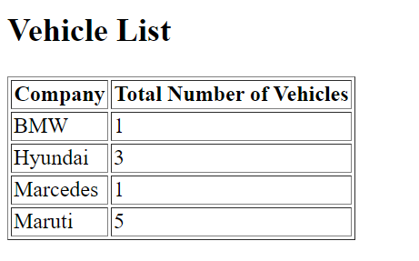
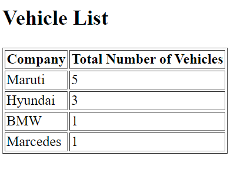

# KeyValue Pipe 
Angular supports iteration over map in html templates through `keyValue` pipe. This repository demonstrate the use of keyValue and sorting feature supported with this.

## Problem Statement
There is an list of registered vehicles provided to application which gives details about the number and the company name of the vehicles.

```typescript
    export const vehicleList = [
        ...
        ...
        {
        number: "MH12-KY-1234",
        company: "Maruti"
        },
        {
        number: "MH12-KY-1235",
        company: "BMW"
        },
        {
        number: "MH12-KY-1236",
        company: "Hyundai"
        },
        ...
        ...
  ]
```
Now suppose app has requirement to show the vehicle company name and total number of vehicles registered for each brand in a table.

## Solution

One of the best solution to such kind of problem is to create a map having key/value pair of companies and total number of vehicles registerd.

It can be done like below

```typescript
    vehicleList.map(vehicle => {
      this.vehicleCategories.set(vehicle.company, (this.vehicleCategories.get(vehicle.company) ?? 0) + 1);
    });
```
Now `vehicleCategories` has key/value pair of vehicle companies and total number of vehicles registed for each companies.

### Iterating map in template file
Angular support direct iteration of map using it's structural directive `ngFor` and with the help of keyValue pipe. Now application can iterate map in template file in following way
```html
<div>
  <h1>Vehicle List</h1>
  <table border=1>
    <tr>
      <th>Company</th>
      <th>Total Number of Vehicles</th>
    </tr>
    <tr *ngFor="let company of vehicleCategories | keyvalue">
      <td>{{company.key}}</td>
      <td>{{company.value}}</td>
    </tr>
  </table>
</div>
```
This will result in a table like below


### Showing result sorted
Seeing above picture clearing gives urge of seeing the result in sorted order. This is possible as `keyValue` pipe support sorting function as parameter. 
We can rewrite our template as below
```html
<div>
  <h2>Vehicle List</h2>
  <table border="1">
    <tr>
      <th>Company</th>
      <th>Total Number of Vehicles</th>
    </tr>
    <tr *ngFor="let company of vehicleCategories | keyvalue : sort">
      <td>{{company.key}}</td>
      <td>{{company.value}}</td>
    </tr>
  </table>
</div>
```
Now sort function can be written in component.ts file for decending order like this
```typescript
sort(vehichleA: {key: string; value: number;}, vehichleB: {key: string; value: number;}) {
    return vehichleB.value - vehichleA.value;
  }
```
After doing all the above suggested changes, we will get sorted list of tables



Thanks for reading!!!
